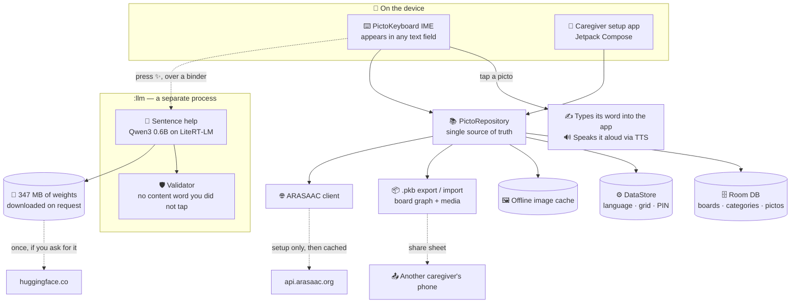

<div align="center">


# PictoKeyboard

**Give a voice to anyone who can't type.**

*A native Android pictogram keyboard (IME): tap an [ARASAAC](https://arasaac.org) pictogram → it **types its word into any app and speaks it aloud**.*

<br>

[](#build--install)
[](https://kotlinlang.org)
[](./LICENSE)
[](https://arasaac.org/terms-of-use)
[](https://github.com/SelfishCoconut/pictokeyboard/releases/latest)
[](https://github.com/SelfishCoconut/pictokeyboard/stargazers)

[🌟 Features](#key-features) • [📥 Download](#demo--download) • [📸 Screenshots](#screenshots) • [🧩 Architecture](#architecture) • [🛠 Build](#build--install) • [📜 License](#licensing--attribution)

</div>

---

PictoKeyboard replaces letters with [ARASAAC](https://arasaac.org) pictograms.
It is meant to be **set up by a parent or psychologist** (the setup screens are
protected by an admin PIN) and **used by the end user** — someone with speech or
typing difficulties — directly inside WhatsApp, notes, search bars, or any other
text field.

## Demo & download

- 📦 **[Latest release](https://github.com/SelfishCoconut/pictokeyboard/releases/latest)** — sideload on Android 8.0+
- ▶️ **[Watch the demo video](https://github.com/SelfishCoconut/pictokeyboard/releases/latest/download/demo.mp4)**
- 📄 **[Visual guide (PDF)](media/PictoKeyboard-guia-visual.pdf)** — picture instructions for caregivers

> The published release is still **v0.1.0**, the June MVP. It predates the
> removal of the server, board files, Android 16, the word arrows, the bell and
> sentence help. Until a v0.2.0 is signed and published, build from `main` —
> the two commands are under [Build & install](#build--install).

## Key features

- **System keyboard (IME):** works in any app's text field.
- **Two‑panel layout:** a colour‑coded category strip on the left, a large
  pictogram grid on the right.
- **Category frame colours:** every pictogram is framed in its category's
  colour so the user can associate pictos with their category. Categories can
  be the seeded defaults *or* fully custom, each with its own frame colour.
- **Tap = type + speak:** the picto's text is inserted and read aloud (TTS).
- **Walk the phrase with arrows.** ◀ and ▶ select a word *in the host app's own
  field* — a real selection, so the user sees it highlighted — and read it
  aloud; backspace then removes that word rather than the last one. Reach the
  wrong word, take it out, tap the right one.
- **A red bell that calls for help.** Put a caregiver's number in Settings and
  the keyboard gets a bell that rings it, after a four‑second countdown you can
  cancel and a spoken warning saying who is being called. No number, no bell.
- **Sentence help — a language model on the phone** *(experimental, off by
  default)*. Tap `yo querer agua`, press ✨, and it becomes **"Quiero agua."**;
  press again to get your exact words back. It runs a 347 MB Qwen3 0.6B model
  in its own process, downloaded only if you ask for it. **It cannot put words
  in your mouth:** a validator enforces that the content words coming out are a
  subset of the ones you tapped, so it may add articles and conjugation but
  never a thing about the world you did not choose, and negation is checked
  separately and more strictly. If nothing passes, your words are left exactly
  as typed. See [`docs/sentence-help-model.md`](docs/sentence-help-model.md).
- **ARASAAC integration:** search ARASAAC during setup; images are downloaded
  and cached locally so the keyboard works **fully offline** afterwards.
- **Bilingual:** Spanish and English picto text + TTS voice, selectable per
  pictogram.
- **Blind mode:** an eyes‑free, gesture‑driven keyboard with large spoken
  feedback, toggled with a two‑finger double‑tap.
- **PIN‑protected setup**, configurable grid (columns / rows / captions),
  adjustable speech rate & pitch.
- **High contrast** — pure black and white, heavier strokes and thicker text —
  applied to the keyboard as well as to the setup app, and a haptic tick that
  confirms a key was hit for someone who cannot watch the field.
- **Boards travel as files.** Export a board — or the whole device — as a single
  `.pkb`, photographs included, and send it through the share sheet to any app:
  WhatsApp, Gmail, Drive, Nearby Share. Importing adds, and never overwrites
  what is already there.
- **Move a category between boards**, with its symbols, and undo it in one tap.
- **No account, no server, no sign‑in.** Nothing to create, nothing to leak,
  nothing standing between someone and their words.

## Screenshots

|  |  |  |
|:--:|:--:|:--:|
|  |  |  |
| Tap a picto → it types **and** speaks in any app | Colour‑coded category manager | New category from a template |
|  |  |  |
| Add your own image pictos | Language, grid & speech settings | Eyes‑free “blind mode” feedback |

## Default categories

Seeded on first launch (ARASAAC‑style AAC colours), all renameable/removable:

| Category | People | Actions | Food | Feelings | Places | Objects | Time |
|----------|:------:|:-------:|:----:|:--------:|:------:|:-------:|:----:|
| **Frame colour** | 🟡 Amber | 🟢 Green | 🟠 Orange | 🔴 Red | 🔵 Blue | 🟣 Purple | ⚪ Grey |

## Architecture

How a single tap turns into typed‑and‑spoken text, and where the data lives:



**Why the model is a process and not a class.** The weights and the runtime's
arenas are roughly a gigabyte resident, and a keyboard is the one app on the
phone that must never be the thing Android kills — losing it mid‑sentence takes
away somebody's voice. Putting the model behind a binder means the system can
reclaim all of it under pressure and the keyboard simply carries on without the
✨ key. Every failure on that boundary — a dead binder, no weights, a model that
will not load — is reported as *unavailable* and never as an exception.

<details>
<summary><b>Module layout</b></summary>

```
ime/         InputMethodService + category/picto RecyclerView adapters + TTS
data/db      Room: Category & Picto entities, DAOs, AppDatabase
data/prefs   DataStore settings (language, grid, TTS, salted‑hash PIN)
data/arasaac Retrofit ARASAAC client + offline image cache
data/pkb     .pkb export/import — a ZIP holding the board graph and the
             photographs it refers to, addressed by the SHA‑256 of their bytes
data/backup  the legacy one‑board JSON, kept so old backups still import
data/repo    PictoRepository (single source of truth, seeding)
sentence/    the model: capability check, download and SHA-256 verify, prompts,
             the validator that decides what may reach the field, benchmark
sentence/llm the :llm process — AIDL, the client's end of the binder, and the
             LiteRT-LM engine, which exists only on the far side of it
tts/         TtsManager: one voice per word, so a mixed-language board reads
             correctly rather than in whichever voice the phone prefers
ui/          Jetpack Compose setup app (onboarding, categories, pictos,
             ARASAAC search, settings, about/credits)
di/          ServiceLocator (lightweight manual DI shared by Activity + IME)
```

</details>

> **This is the offline edition, and it is `main`.** A marketplace — publishing
> boards to a catalogue, browsing other caregivers' boards, and the accounts
> those need — was built as far as its account layer and then taken out (#119).
> It lives on the [`marketplace`](https://github.com/SelfishCoconut/pictokeyboard/tree/marketplace)
> branch with its issues, under the *Marketplace edition* milestone. Sharing a
> board with another caregiver is a file and the share sheet here, which needs
> no backend and no sign‑up.

## Build & install

Requirements: **Android Studio** (Ladybug or newer) or the Android SDK with
JDK 21. The project compiles against `compileSdk 37` and targets
`targetSdk 36` (Android 16), `minSdk 26` (Android 8.0). Bytecode targets
Java 17.

### Android Studio (recommended)
1. `File ▸ Open` this folder. Studio downloads Gradle 9.6.1 and the SDK.
2. Plug in a device (USB debugging on) or start an emulator.
3. Press **Run ▸ app**.

### Command line
```bash
# Point at your SDK if not already configured:
echo "sdk.dir=$HOME/Android/Sdk" > local.properties

./gradlew assembleDebug          # build app/build/outputs/apk/debug/app-debug.apk
./gradlew installDebug           # build + install on the connected device
```
> The Gradle wrapper (including `gradle/wrapper/gradle-wrapper.jar`) is
> committed, as Gradle recommends. It is the single source of truth for the
> Gradle version used by both local builds and CI, so a wrapper upgrade is
> tested like any other change. CI verifies the jar's checksum on every run.

## Turning it on (on the device)

1. Open **PictoKeyboard** (the launcher app).
2. **Enable PictoKeyboard** → opens Android input settings, toggle it on.
3. **Choose PictoKeyboard** → keyboard picker, select it.
4. Build the board under **Categories & pictos** (search ARASAAC, add pictos).
5. Optionally set an **admin PIN** in **Settings** to lock the setup screens.

The 🌐 key on the keyboard switches to another keyboard. Reopen the setup app
from its own launcher icon: the keyboard has no key that opens it, and the only
activity it ever starts is the assistance call.

## Licensing & attribution

The PictoKeyboard **application source code** is released under
[**CC BY‑NC‑SA 4.0**](./LICENSE) — the same license as the pictograms, so the
whole project stays non‑commercial and share‑alike. There is no relicensing
escape hatch: Creative Commons has designated **no** licenses as compatible
with BY‑NC‑SA, so any derivative must remain under CC BY‑NC‑SA 4.0.

The **pictograms are credited separately**: PictoKeyboard does **not** bundle
ARASAAC images; it fetches them at setup time.
The pictographic symbols are property of the Government of Aragón, created by
Sergio Palao for ARASAAC, distributed under **CC BY‑NC‑SA 4.0**
(non‑commercial). See [`NOTICE`](./NOTICE). The required attribution is also
shown in the app's **About & credits** screen.

- License: https://creativecommons.org/licenses/by-nc-sa/4.0/deed.en
- ARASAAC terms of use: https://arasaac.org/terms-of-use

## Privacy

**What you type never leaves the phone.** No analytics, no crash reporting, no
advertising, no tracking, **no account and no server**. Your boards, pictograms
and photographs stay on the device. The keyboard honours
`IME_FLAG_NO_PERSONALIZED_LEARNING` and never records anything from a password
field.

The app makes outbound requests to exactly two places, neither carrying any
identifier: **ARASAAC**, for a pictogram image during setup, and **Hugging
Face**, only if you switch on sentence help and ask for the model — a single
347 MB download of a file whose SHA‑256 is pinned in the source. Nothing else
leaves, and nothing you write is part of either. `AppHasNoAccountsTest` fails
the build if any source file so much as imports an authentication stack.

The app asks for three permissions and no others: `INTERNET` and
`ACCESS_NETWORK_STATE`, for the two downloads above, and **`CALL_PHONE`**, used
by one key — the assistance bell — to dial the number a caregiver typed in.
Without the grant the bell falls back to opening the dialler with the number in
it, so the call still happens; it just takes one more tap.

The other side of that: **nothing is backed up for you.** A phone that is lost
or reset takes the boards with it, so export a `.pkb` and keep it somewhere.

- Privacy policy: https://selfishcoconut.github.io/pictokeyboard/privacy/
- En español: https://selfishcoconut.github.io/pictokeyboard/es/
