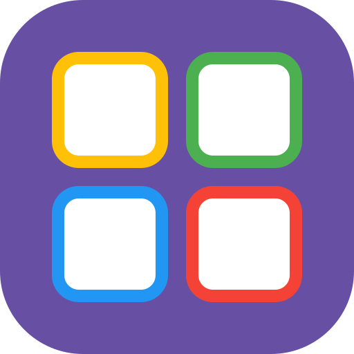
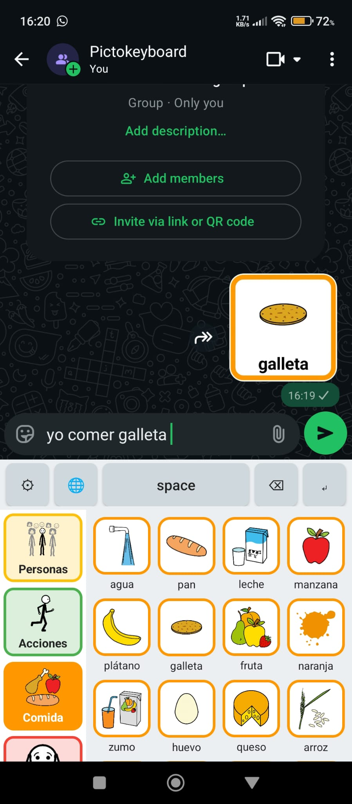
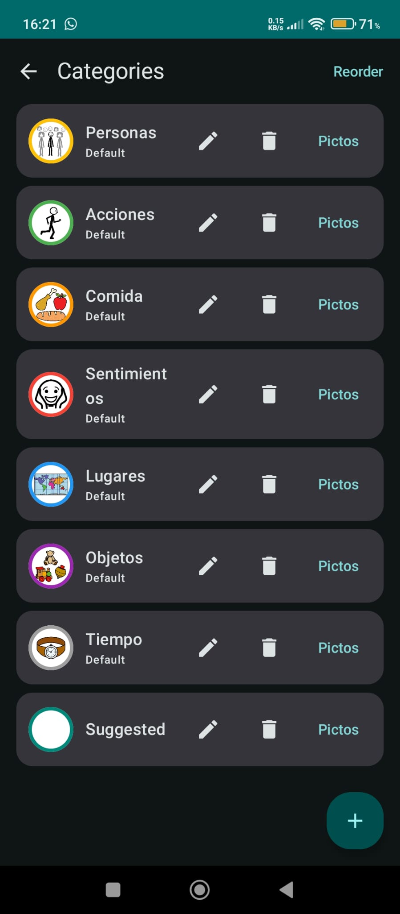
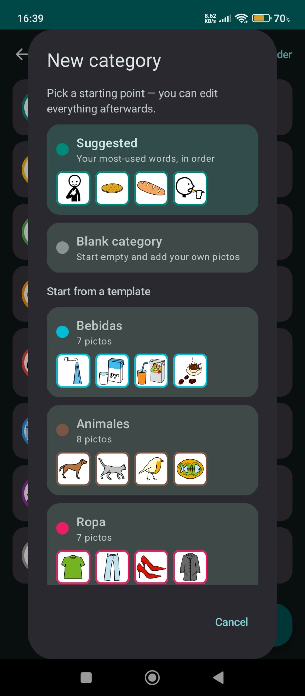
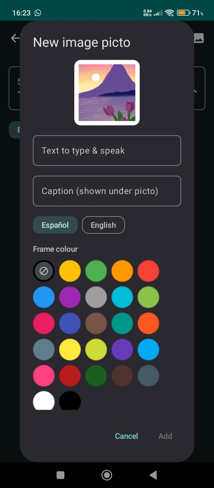
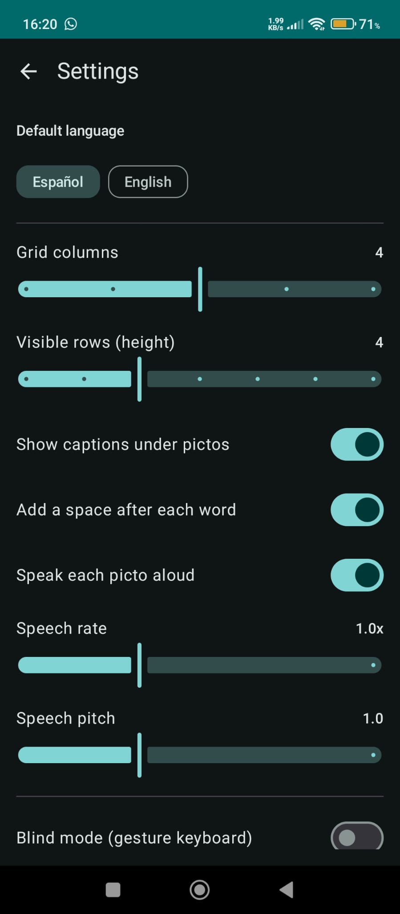
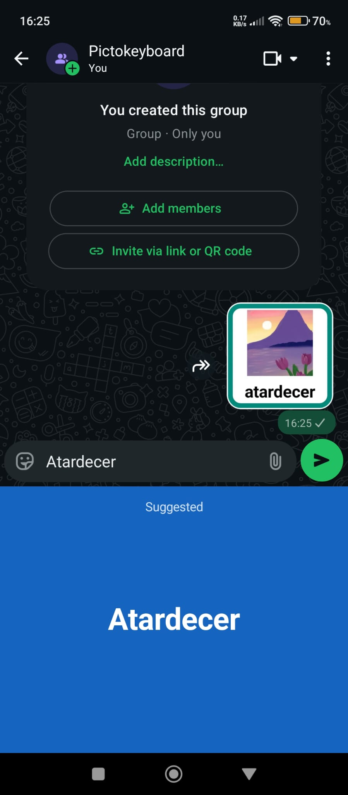
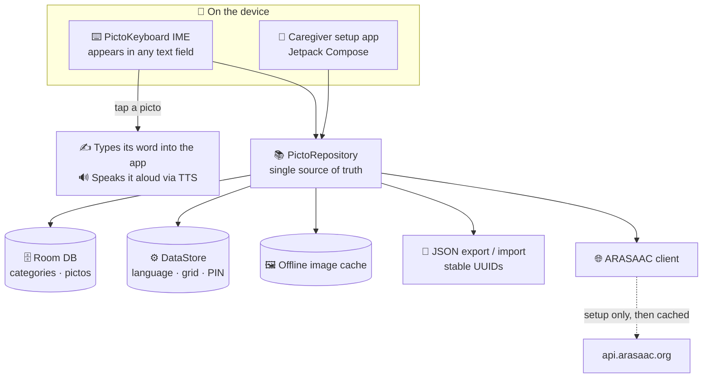

<div align="center">



# PictoKeyboard

**Give a voice to anyone who can't type.**

*A native Android pictogram keyboard (IME): tap an [ARASAAC](https://arasaac.org) pictogram → it **types its word into any app and speaks it aloud**.*

<br>

[](#build--install)
[](https://kotlinlang.org)
[](./LICENSE)
[](https://arasaac.org/terms-of-use)
[](https://github.com/SelfishCoconut/pictokeyboard/releases/latest)
[](https://github.com/SelfishCoconut/pictokeyboard/stargazers)

[🌟 Features](#key-features) • [📥 Download](#demo--download) • [📸 Screenshots](#screenshots) • [🧩 Architecture](#architecture) • [🛠 Build](#build--install) • [📜 License](#licensing--attribution)

</div>

---

PictoKeyboard replaces letters with [ARASAAC](https://arasaac.org) pictograms.
It is meant to be **set up by a parent or psychologist** (the setup screens are
protected by an admin PIN) and **used by the end user** — someone with speech or
typing difficulties — directly inside WhatsApp, notes, search bars, or any other
text field.

## Demo & download

- 📦 **[Download the MVP APK](https://github.com/SelfishCoconut/pictokeyboard/releases/latest/download/Pictokeyboard-MVP.apk)** — sideload on Android 8.0+
- ▶️ **[Watch the demo video](https://github.com/SelfishCoconut/pictokeyboard/releases/latest/download/demo.mp4)**
- 📄 **[Visual guide (PDF)](media/PictoKeyboard-guia-visual.pdf)** — picture instructions for caregivers

## Key features

- **System keyboard (IME):** works in any app's text field.
- **Two‑panel layout:** a colour‑coded category strip on the left, a large
  pictogram grid on the right.
- **Category frame colours:** every pictogram is framed in its category's
  colour so the user can associate pictos with their category. Categories can
  be the seeded defaults *or* fully custom, each with its own frame colour.
- **Tap = type + speak:** the picto's text is inserted and read aloud (TTS).
- **ARASAAC integration:** search ARASAAC during setup; images are downloaded
  and cached locally so the keyboard works **fully offline** afterwards.
- **Bilingual:** Spanish and English picto text + TTS voice, selectable per
  pictogram.
- **Blind mode:** an eyes‑free, gesture‑driven keyboard with large spoken
  feedback, toggled with a two‑finger double‑tap.
- **PIN‑protected setup**, configurable grid (columns / rows / captions),
  adjustable speech rate & pitch.
- **JSON export/import** of the whole board with stable UUIDs (designed so a
  future psychologist web backend can sync the same data shape).

## Screenshots

|  |  |  |
|:--:|:--:|:--:|
|  |  |  |
| Tap a picto → it types **and** speaks in any app | Colour‑coded category manager | New category from a template |
|  |  |  |
| Add your own image pictos | Language, grid & speech settings | Eyes‑free “blind mode” feedback |

## Default categories

Seeded on first launch (ARASAAC‑style AAC colours), all renameable/removable:

| Category | People | Actions | Food | Feelings | Places | Objects | Time |
|----------|:------:|:-------:|:----:|:--------:|:------:|:-------:|:----:|
| **Frame colour** | 🟡 Amber | 🟢 Green | 🟠 Orange | 🔴 Red | 🔵 Blue | 🟣 Purple | ⚪ Grey |

## Architecture

How a single tap turns into typed‑and‑spoken text, and where the data lives:



<details>
<summary><b>Module layout</b></summary>

```
ime/         InputMethodService + category/picto RecyclerView adapters + TTS
data/db      Room: Category & Picto entities, DAOs, AppDatabase
data/prefs   DataStore settings (language, grid, TTS, salted‑hash PIN)
data/arasaac Retrofit ARASAAC client + offline image cache
data/backup  JSON export/import (stable UUIDs, sync‑ready)
data/repo    PictoRepository (single source of truth, seeding)
ui/          Jetpack Compose setup app (onboarding, categories, pictos,
             ARASAAC search, settings, about/credits)
di/          ServiceLocator (lightweight manual DI shared by Activity + IME)
```

</details>

> The web portal for psychologists is **out of scope for now**; the JSON backup
> format and stable IDs are the seam it will plug into later.

## Build & install

Requirements: **Android Studio** (Ladybug or newer) or the Android SDK with
JDK 17. The project targets `compileSdk 34`, `minSdk 26` (Android 8.0).

### Android Studio (recommended)
1. `File ▸ Open` this folder. Studio downloads Gradle 8.9 and the SDK, and
   regenerates the Gradle wrapper jar automatically.
2. Plug in a device (USB debugging on) or start an emulator.
3. Press **Run ▸ app**.

### Command line
```bash
# Point at your SDK if not already configured:
echo "sdk.dir=$HOME/Android/Sdk" > local.properties

./gradlew assembleDebug          # build app/build/outputs/apk/debug/app-debug.apk
./gradlew installDebug           # build + install on the connected device
```
> The committed repo does not include the binary `gradle/wrapper/gradle-wrapper.jar`.
> Android Studio regenerates it on sync. To create it from a CLI with Gradle
> installed: `gradle wrapper --gradle-version 8.9`.

## Turning it on (on the device)

1. Open **PictoKeyboard** (the launcher app).
2. **Enable PictoKeyboard** → opens Android input settings, toggle it on.
3. **Choose PictoKeyboard** → keyboard picker, select it.
4. Build the board under **Categories & pictos** (search ARASAAC, add pictos).
5. Optionally set an **admin PIN** in **Settings** to lock the setup screens.

The ⚙ key on the keyboard reopens this setup app; the 🌐 key switches keyboards.

## Licensing & attribution

The PictoKeyboard **application source code** is released under the
[Beer-Ware License](./LICENSE) (Revision 42) — do whatever you want with it.

The **pictograms are a separate matter**: PictoKeyboard does **not** bundle
ARASAAC images; it fetches them at setup time.
The pictographic symbols are property of the Government of Aragón, created by
Sergio Palao for ARASAAC, distributed under **CC BY‑NC‑SA 4.0**
(non‑commercial). See [`NOTICE`](./NOTICE). The required attribution is also
shown in the app's **About & credits** screen.

- License: https://creativecommons.org/licenses/by-nc-sa/4.0/deed.en
- ARASAAC terms of use: https://arasaac.org/terms-of-use
